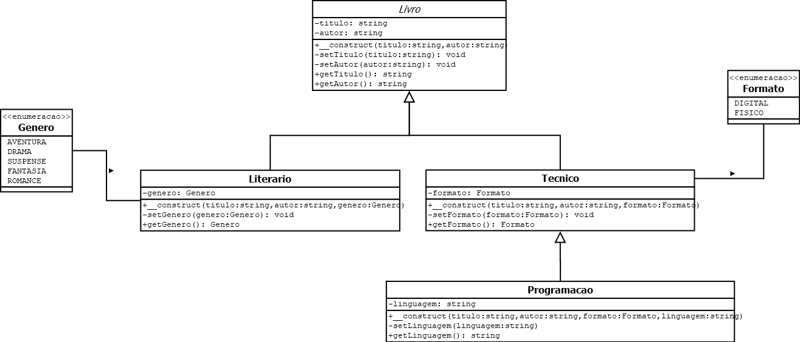

# Exercícios de PHP com POO
---
## Exercício 03

1) Analise o diagrama abaixo

2) Faça os ajustes necessários na classe Livro em relação aos atributos e métodos (incluindo o construtor).

3) Implemente a subclasse **Tecnico** (herdando tudo da superclasse **Livro**) e atribua também suas próprias propriedades e métodos.

*Obs.: veja que `formato` é uma enumeração com valores pré-definidos.*

4) Implemente a subclasse **Literario** (herdando tudo da superclasse **Livro**) e atribua também suas próprias propriedades e métodos.

*Obs.: veja que `genero` é uma enumeração com valores pré-definidos.*

5) Implemente a subclasse **Programacao** herdando tudo da subclasse **Tecnico** e atribua também suas próprias propriedades e métodos.

4) Na index.php, crie alguns objetos do tipo `Literario` e `Programação` e atribua alguns valores a eles. Em seguida, mostre alguns destes dados usando tags HTML.
---
## Exercicio 02
1) Adapte a classe `Livro` aplicando a ela um método `construtor`.

2) Faça o `construtor` receber os parâmetros necessários para inicialização dos objetos.

3) Mude a visibilidade dos `setters` para `private`.

4) Na `index`, ajuste o objeto existente para que ele use o `construtor` passando os dados diretamente.

5) Também na `index` retire os `setters`.

---
## Exercício 01

1) Analise o diagrama abaixo e programe a Classe `Livro` no PHP dentro de uma nova pasta `src`.

2) Utilize o arquivo `index.php` para importar a classe, e crie pelo menos um objeto a partir dela, definindo um **título**, **autor** e **número de páginas**.

3) Acesse e mostre os dados do objeto usando tags HTML.